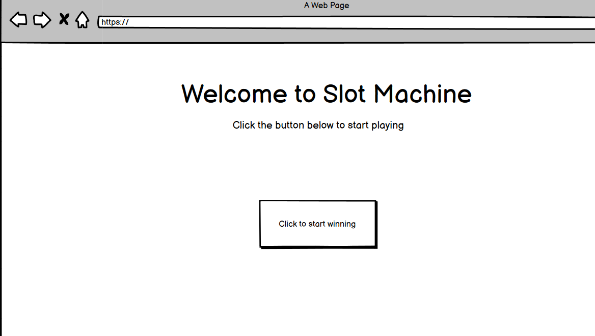
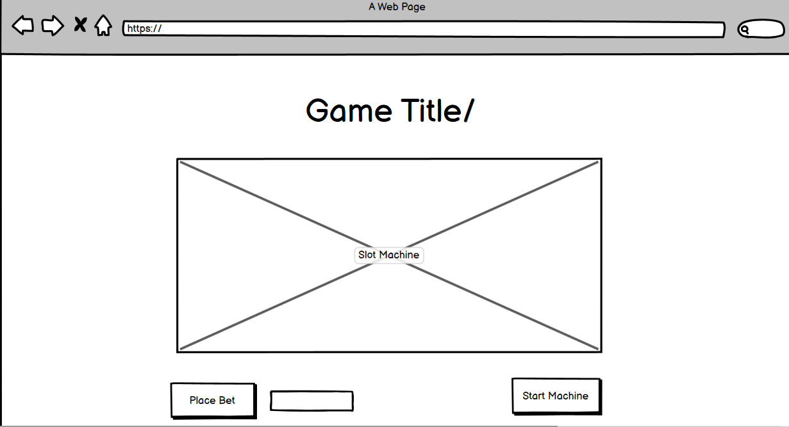

# My Slot-Machine

### Description

Who needs Vegas when Vegas can come straight to your home? Welcome to "**My Slots**", a simple Javascript powered, in-browser video game that simulates the experience of high dollar Las Vegas Casino slot reels. 

Goodbye Luxor! See ya later Caesar's Palace! Sayonara Bellagio! Who needs to see the glits and glamour of the Vegas strip when you can sit in front of your monitor and play **My Slots**! Customize your slot reels by choosing from a catelog of sprites with different modifier values. Win non-real virtual money, that's almost as good as the real thing. 

Come try **My Slots** today and see if you've got what it takes to be beat the House.

## How to run

**My Slots** is accessible through this link (will include link after project completion)

## Wire Frame

## User Stories

### MVP

As a user I want to....

1. See the slot machine rendered on page
    - Create a gameDiv for each column for the slot machine
        - Have dropdown box for number of columns to play with. Whatever the value of that element is, assign it to an undefined variable called columnNumber: 
        `let columnNumber`
        - Create a function that generates a gameDiv and then loop through the number of columns the user chose to generate the chosen number of gameDivs:  
        `for(i = 0; i < columnNumber; i++) {create gameDiv}`  
         `const gameDiv = document.createElement('div')`  
         `gameContainer.append(gameDiv)`
    - Render each gameDiv on page depending on how many columns the user wants to play with

2. Have the option to place bet
    -Create input box for user's bet to be placed.  
        `<input class="?">[placeHolder value]</input>`
    - Create a button that on click takes user's input from box and set that to a variable named 'bet'  
        `button.addEventListener('click', getBetInput)`
         
    - Have user's bet rendered on page 
        -use queryselector to access input box value and create/modify a 'div' to display the bet    
            `const betDiv = document.createElement('div')`
            `betDiv.innerHTML = userBet`

3. Start game after bet is placed  
       - **Game mechanic:**  
          Create one array and randomly choose from the list and push the item chosen into three empty arrays each representing a column on the slot machine. Every symbol that wasn't chosen will somehow have to be rendered in a specific order in relation to the chosen symbol so that every column will appear to be identical
                Have a constant that equals the number of columns that the user can choose from. Range of columns is from 3 - 10  
                `const slotResult = [array of symbols]`  
                - Create a function to generate a random symbol for the number of columns (if there are 3 columns, then run getRandomSymbol 3x)  
                    `const randomSymbol = Math.floor(Math.random() * randomSymbol.length + 1)`  
                    `const column1, column2, column3, etc. = []`  
                - Run getRandomSymbol by the number of columns the user chose previously
                - Create a function (or simply an array with the winning combinations) that checks to see the order of the slotResults. If the slotResult is equal to AT LEAST 3 of any symbol then it is a winning list. The function MUST somehow check through ANY consecutive trio throughout the columns. For example:
                    - If 10 columns, a trio is a win, but every 4th, 5th, 6th, etc. pairing is an additional multiplier

4. See the result of the roulette  
    `const reelDiv = document.createElement('div')`  
    `reelDiv.innerHTML = randomSymbol`  
    `reelDiv.append(slotResult)`  
    `gameContainer.append(reelDiv)`
    - Because the user can create multiple columns and there is only one array for the roulette results, each gameDiv will have to be looped through and assigned to their corresponding symbol in the roulette result array. So if the user selected four columns then they also created four gameDivs. And if their turn produced the following roulette result: ['pigeon', 'hummingbird', 'cardinal', 'cardinal'], then a function must be created (with the array as an input) to loop through and display each index to the corresponding gameDiv number.
    
5. Be notified of a winning/losing round and see my balance increase/decrease depending on round result
    - Function that checks for identical contiguous values  
     `function findContiguousValues(){`  
            `return contiguousNum`  
        `}`  
    `if (reelResult !== contiguousValue){`  
        `roundLoss = true`  
        `userFunds -= playValue`  
    `}`  
    `else{`  
        `roundWin = true`  
        `userFunds += sumOf(contiguousNum)`  
        `}`  
6. Select another round
7. Option to cash out/end game  
    `If cashOut button clicked === true || userFunds <= 0 {`  
        `gameOver === true`  
        `display.innerHTML = "Game Over. Your funds: ${userFunds}`  
        `}`
    

### Ver.2

As a user I want....

- A description of game mechanics
- A description of item multipliers
- To keep track of rounds/slot pulls
- To start a new game

### Ver.3

As a user I want....

- To keep track of lifelong winnings

